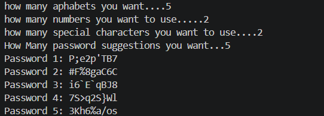

# 🔐 Password Generator (Python)

<p align="center">
  
  
  
  
  
</p>

---

# 📖 Overview

**Password Generator** is a Python-based command-line application that generates strong and randomized passwords based on user preferences.

Instead of generating passwords with a fixed pattern, the user specifies how many:

- 🔤 Alphabets
- 🔢 Numbers
- 🔣 Special Characters

should be included in the password.

The program then creates a randomized password using Python's built-in **random** module.

This project is an excellent beginner-friendly exercise for understanding:

- Lists
- Loops
- User Input
- Randomization
- Python Modules
- String Manipulation

---

# 📸 Project Preview

<p align="center">



</p>


---

# ✨ Features

- 🔤 Custom number of alphabets
- 🔢 Custom number of numbers
- 🔣 Custom number of special characters
- 🎲 Random character generation
- 🔀 Randomized password output
- 💻 Command-line interface
- ⚡ Lightweight Python application
- 📚 Beginner-friendly project
- 🚀 No external libraries required

---

# 🛠 Technologies Used

| Technology | Purpose |
|------------|---------|
| Python 3 | Programming Language |
| Random Module | Character Selection & Randomization |
| Lists | Store Character Sets |
| Loops | Password Construction |
| User Input | Custom Password Configuration |

---

# 📂 Project Structure

```text
password-generator/
│
├── password_generator.png
│   
│
├── password_generator.py
├── README.md
├── LICENSE
└── .gitignore
```

---

# 📄 File Description

| File | Description |
|------|-------------|
| `password_generator.py` | Main program responsible for collecting user input, generating random characters, and creating the final password. |
| `README.md` | Documentation explaining the project, setup, and functionality. |
| `LICENSE` | MIT License for open-source usage. |
| `.gitignore` | Prevents unnecessary files from being uploaded to GitHub. |
| `password_generator.png` | Screenshots used in the README. |

---

# 🧩 Program Architecture

```text
            User
              │
              ▼
      Enter Requirements
              │
              ▼
     Generate Characters
              │
              ▼
      Store in List
              │
              ▼
      Shuffle Password
              │
              ▼
     Display Password
```

---

# ⚙️ How It Works

## 1️⃣ User Input

The program asks the user to enter:

- Number of alphabets
- Number of numbers
- Number of special characters

Example:

```text
How many alphabets do you want? 6

How many numbers do you want? 3

How many special characters do you want? 2
```

---

## 2️⃣ Character Selection

The application maintains three separate lists:

- Alphabets
- Numbers
- Special Characters

Using Python's **random.choice()**, random characters are selected according to the user's input.

---

## 3️⃣ Password Generation

Selected characters are stored in a list.

The password is then randomized to remove predictable ordering.

Finally, the list is converted into a single string and displayed.

---

# 🔄 Program Flow

```text
Start

↓

Take User Input

↓

Generate Letters

↓

Generate Numbers

↓

Generate Special Characters

↓

Randomize Password

↓

Display Password

↓

End
```

---

# 🚀 Getting Started

## Clone Repository

```bash
git clone https://github.com/just-prem22/password-generator.git
```

---

## Navigate to Project

```bash
cd password-generator
```

---

## Run the Program

```bash
python password_generator.py
```

---

# 💡 Example Output

```text
How many alphabets do you want?
6

How many numbers do you want?
3

How many special characters do you want?
2

Generated Password:

A7@kQ9#Lm2
```

---

# 📚 Concepts Demonstrated

This project demonstrates:

- Python Basics
- Lists
- Loops
- User Input
- String Manipulation
- Random Module
- Command Line Applications
- Problem Solving
- Algorithm Design

---

# 📈 Time Complexity

| Operation | Complexity |
|-----------|------------|
| Generate Letters | O(a) |
| Generate Numbers | O(b) |
| Generate Symbols | O(c) |
| Shuffle Password | O(n) |
| Total | O(n) |

where **n = total password length**.

---

# 🔒 Password Strength

The generated password strength depends on:

- Number of alphabets
- Number of numbers
- Number of special characters
- Overall password length

Longer passwords containing a mix of all character types provide stronger protection.

---

# 🚀 Future Improvements

Potential enhancements include:

- 🔐 Password strength meter
- 👁️ Show / Hide password
- 📋 Copy password to clipboard
- 🎨 GUI using Tkinter
- 🌐 Web version
- 📱 Mobile application
- ⚙️ Save password to file
- 🔑 Generate multiple passwords
- 🎯 Password presets (Weak / Medium / Strong)
- 🤖 Custom character exclusions

---

# 🤝 Contributing

Contributions are welcome!

1. Fork the repository.

2. Create a new branch.

```bash
git checkout -b feature/YourFeature
```

3. Commit your changes.

```bash
git commit -m "Add Your Feature"
```

4. Push the branch.

```bash
git push origin feature/YourFeature
```

5. Open a Pull Request.

Every contribution helps improve the project.

---

# ⭐ Support

If you found this project useful, consider giving it a **⭐ Star** on GitHub.

Your support motivates future improvements and helps the project reach more developers.

---

# 📜 License

This project is licensed under the **MIT License**.

See the `LICENSE` file for more information.

---

# 👨‍💻 Author

**Prem Kumar**

GitHub: https://github.com/just-prem22

---

<p align="center">
  <b>Made with ❤️ using Python</b>
</p>
